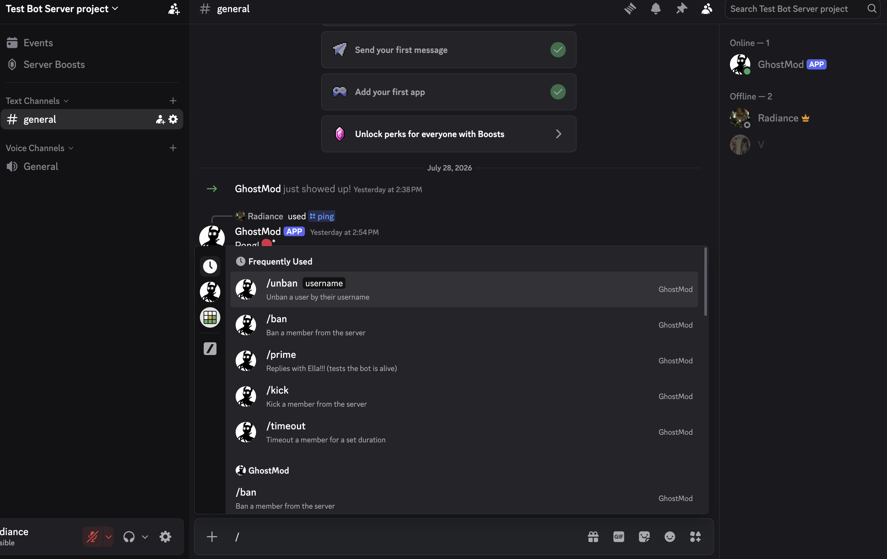
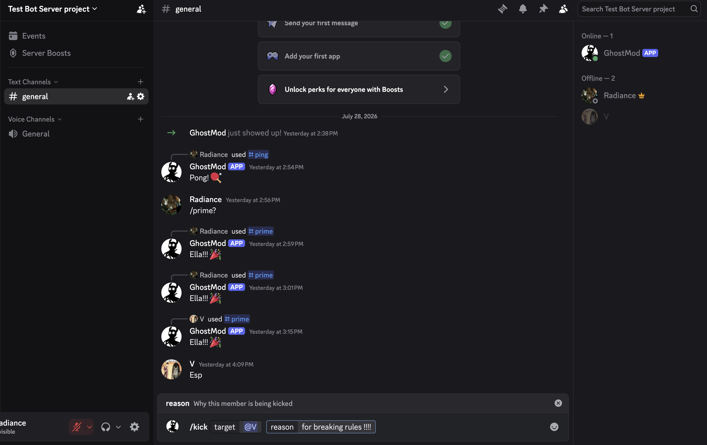
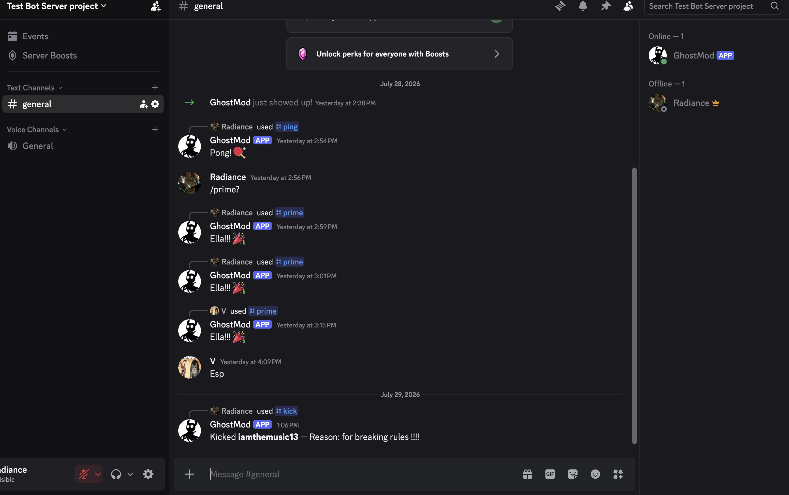

# discord-moderator-bot

A Discord moderation bot built with [discord.js](https://discord.js.org/) v14 and TypeScript. It provides slash commands for common moderation actions: kicking, banning, unbanning, and timing out members.

## Commands

| Command    | Description                                                    | Options                                                                                                                           |
| ---------- | -------------------------------------------------------------- | --------------------------------------------------------------------------------------------------------------------------------- |
| `/prime`   | Replies with a greeting — useful for checking the bot is alive | —                                                                                                                                 |
| `/kick`    | Kicks a member from the server                                 | `target` (user, required), `reason` (string, optional)                                                                            |
| `/ban`     | Bans a member from the server                                  | `target` (user, required), `reason` (string, optional), `delete_days` (integer 0-7, optional) — days of message history to delete |
| `/unban`   | Unbans a user by their exact username                          | `username` (string, required)                                                                                                     |
| `/timeout` | Times out a member for a set duration                          | `target` (user, required), `minutes` (integer 1-40320, required), `reason` (string, optional)                                     |

Each destructive command checks Discord role hierarchy before acting (e.g. it won't try to kick/ban/timeout a member with an equal or higher role than the bot) and replies with an ephemeral error if the action isn't possible.

## Project structure

- [src/index.ts](src/index.ts) — logs the bot into Discord and handles incoming slash command interactions.
- [src/deploy-commands.ts](src/deploy-commands.ts) — registers (deploys) the slash commands to a specific Discord server (guild) via the Discord REST API. Run this once, and again any time commands change.

## Setup

### 1. Install dependencies

```bash
npm install
```

### 2. Create a Discord application & bot

1. Go to the [Discord Developer Portal](https://discord.com/developers/applications) and create a new application.
2. Under **Bot**, create a bot user and copy its token.
3. Under **OAuth2 > URL Generator**, select the `bot` and `applications.commands` scopes, along with the permissions you need (Kick Members, Ban Members, Moderate Members, etc.), and use the generated URL to invite the bot to your server.
4. Under **Bot**, enable the **Server Members Intent** and **Message Content Intent** (both are required by this bot).

### 3. Configure environment variables

Create a `.env` file in the project root:

```env
DISCORD_TOKEN=your-bot-token
CLIENT_ID=your-application-client-id
GUILD_ID=your-server-guild-id
```

### 4. Deploy the slash commands

Registers the commands above to your guild (`GUILD_ID`). Run this once initially, and again whenever you add/change a command:

```bash
npx tsx src/deploy-commands.ts
```

### 5. Run the bot

```bash
npx tsx src/index.ts
```

Once running, you should see `Logged in as <bot-tag>` in the console, and the slash commands will be available in your server.

## Tech stack

- [discord.js](https://discord.js.org/) — Discord API client
- [TypeScript](https://www.typescriptlang.org/) — compiled/run via [tsx](https://github.com/privatenumber/tsx)
- [dotenv](https://github.com/motdotla/dotenv) — loads environment variables from `.env`

## Screenshots




